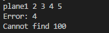
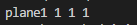
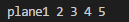
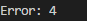
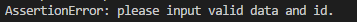

---
# HOMEWORK -- unmanned plane
-------------

> Author: Zhou Ziye  
  Contact me: ziyezzz@163.com  Blog: http://www.cnblogs.com/zzzzy/  
  
This is a homework from ThoughtWorks 2018 campus recruitment<br>
ref: http://join.thoughtworks.cn/candidates/18015

### Result
Input:<br>
Log file content:<br>
<br>
ID: 2, 4, 100<br><br>
Output:<br>
 <br>
Please see next part('Proof of correctness') for more detailed explanation.

### Proof of correctness
The unit testing part is done in the main function. 
Variables 'data'(str) and 'id'(int) are inputs for 'print_log' function, which correspond to 'text content' and 'ID'. They can be changed to other values to verify the correctness of the code.<br>
<br>
Limitations: <br>
1) please do not add unnecessary space in 'data'. <br>
2) 'data' should be a string(not empty), and 'id' should be a non-negative integer.<br>
		 
I have done several tests (the file content is the same as the example in the question instruction):

- id = 0, &nbsp;&nbsp; 
- id = 2, &nbsp;&nbsp; 
- id = 4, &nbsp;&nbsp; 
- id = 5,  &nbsp;&nbsp; 
- id = 100,  &nbsp;&nbsp; 
- id = -2,  &nbsp;&nbsp; 
- id = 'a', &nbsp;&nbsp; 
- (*change data) data = '', &nbsp;&nbsp; 

### Environment
python3, Windows

### Run the code  
``` xml
python UAV.py
```

### Comment
I have set some limitations by 'assert' in the code to make sure the inputs are valid:
- 'id' must be an non-negative integer
- 'data' cannot be empty
